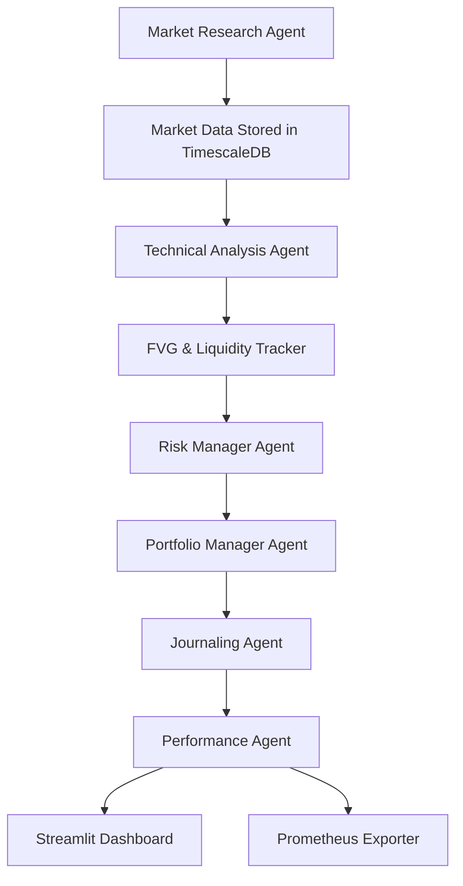

# 📄 Product Requirements Document (PRD)

- Agentic Trading Bot for IFVG + Liquidity Strategy
- Owner: KaalaAadmi
- Environment: Homelab server (Fedora 41, 32GB RAM, Ryzen 7 8845HS)

---

## 🔍 1. Overview

The Agentic Trading Bot is a modular trading automation system designed to implement the Inverse Fair Value Gap (IFVG) + Liquidity strategy, using agent-based architecture. It will autonomously research markets, perform technical analysis, place trades, and monitor performance, all within a containerized and scalable infrastructure deployed in the homelab.

This bot implements a fully automated **Inverse Fair Value Gap (FVG) and Liquidity strategy** using a modular, agent-based architecture. It is designed to:

- Automatically analyze markets (stocks/crypto)
- Detect high-probability trade setups
- Execute risk-managed trades
- Journal and evaluate performance
- Allow introspection and adaptation over time

---

## 🧠 2. Objective

- Implement a consistently profitable discretionary strategy into a rule-based system.

- Avoid overfitting by focusing on confluence (MSB, OBs, IFVGs, liquidity, sessions, volume).

- Maintain modularity to support agent iteration and evolution.

- Enable visual monitoring, logging, and manual review of trade decisions.

---

## ⚙️ Tech Stack Summary

| Layer            | Technology              | Purpose                                |
| ---------------- | ----------------------- | -------------------------------------- |
| Language         | Python                  | Core logic for all agents              |
| Containerization | Docker + Docker Compose | Modular deployment on homelab          |
| Scheduler        | APScheduler             | Schedule agent tasks                   |
| Database         | TimescaleDB             | Store OHLCV, trades, metrics, journal  |
| Message Bus      | Redis Pub/Sub           | Agent communication                    |
| API Layer        | FastAPI                 | Inter-agent API access & control plane |
| Backtesting      | Custom Python Engine    | Strategy-aware replay system           |
| Dashboard        | Streamlit               | Visual interface for logs & stats      |
| Monitoring       | Prometheus + Grafana    | Agent and system monitoring            |

---

## 📦 4. Packages & Libraries

- Data & Analysis:

  - pandas, numpy, datetime

  - yfinance, ccxt (data ingestion)

  - TA-Lib, scikit-learn (optional use)

- Database:

  - psycopg2, sqlalchemy, asyncpg, alembic

- Redis Pub/Sub:

  - redis-py

- APIs:

  - fastapi, pydantic, uvicorn

- Scheduling:

  - apscheduler

- Backtesting:

  - Custom Python backtest engine

- Dashboard & Monitoring:

  - streamlit, plotly, matplotlib

  - prometheus_client, grafana

---

## 🤖 5. AI/Intelligent Agents

Currently, agents are rule-based but designed in a way that future ML/AI modules can be plugged in. Potential areas for adding AI:

- Market Research Agent:

  - Learn optimal screening filters based on past performance.

- Risk Manager Agent:

  - Learn optimal bet sizing dynamically.

- Anomaly Detector Agent:

  - Use ML models to detect strategy underperformance.

- Feedback Agent:

  - Use Reinforcement Learning to self-tune entry rules over time.

## For v1, logic will be deterministic and strategy-driven to avoid overfitting and maintain transparency.

---

## 🧩 6. Agent Architecture & Responsibilities

- Agent Name Responsibility
- Market Research Agent -> Screens assets, fetches OHLCV, stores raw candles
- Market Data Agent (Optional) -> Fetches additional or historical candles
- Technical Analysis Agent -> Detects IFVGs, liquidity levels, MSBs
- FVG Tracker Agent -> Maintains registry of active FVGs, liquidity pools
- Risk Manager Agent -> Calculates dynamic risk %, sizing based on strategy confluence
- Portfolio Manager Agent -> Confirms trade decisions, interacts with broker API
- Journaling Agent -> Logs trades, reasons, timestamps, screenshots, etc.
- Performance Agent -> Analyzes PnL, win rate, R:R, drawdown; updates dashboard
- Notification Agent -> Sends Telegram/Discord alerts (optional)
- Anomaly Detector Agent -> Detects abnormal strategy performance (optional)

---

## 🧠 7. How the Bot Works (System Flow)



---

## 🗃️ 8. Folder Structure

```bash
agentic-trading-bot/
├── agents/
│ ├── market_research/
│ ├── market_data_collector/
│ ├── technical_analysis/
│ ├── fvg_tracker/
│ ├── risk_manager/
│ ├── portfolio_manager/
│ ├── journaling/
│ ├── performance/
│ ├── notification/
│ └── common/ # Shared logic
│
├── api/                  # FastAPI routes
│
├── core/
│   ├── scheduler/              # APScheduler jobs
│   ├── redis_bus/              # Redis pub/sub client
│   ├── logs/
│   |   ├── agent_logs/
│   └── config
│       ├── scheduler_config.yaml
│       └── settings.yaml
│
├── dashboard/                 # Streamlit UI
|
├── db/
│ ├── init.sql
│ └── migrations/
|
├── docker/
│ ├── docker-compose.yml
│ └── Dockerfiles/
│
├── backtesting/               # Custom replay engine
│
├── tests/
│   ├── integration/
│   └── unit/
│
├── main.py
├── requirements.txt
├── .env
└── README.md
```

---

## 🤖 9. Agent Overview

### 1. 🧠 Market Research Agent

- Screens top assets by volume/volatility/structure
- Identifies candidates with unmitigated FVGs and imbalance
- **Immediately stores raw OHLCV data** in the database to reduce latency

### 2. 📊 Market Data Collector Agent

- Cleans, resamples and fills missing market data
- Can be bypassed if Market Research Agent stores raw data

### 3. 📉 Technical Analysis Agent

- Detects IFVGs, MSBs, Liquidity levels, Order Blocks
- Validates trade setup using structure rules

### 4. 🧮 FVG & Liquidity Tracker Agent

- Maintains state of unmitigated FVGs & liquidity zones
- Notifies TA Agent of changes

### 5. 🛡️ Risk Manager Agent

- Manages exposure and position sizing
- Adjusts risk based on confidence, confluences

### 6. 💼 Portfolio Manager Agent

- Executes trades using broker APIs
- Manages open positions and exits

### 7. 📝 Journaling Agent

- Stores trade metadata (entry reason, screenshot, RR, timestamps)
- Writes to TimescaleDB and optional CSVs

### 8. 📈 Performance Agent

- Tracks win rate, drawdown, profit factor
- Sends alerts when metrics degrade
- Feeds data into Streamlit dashboard

### 9. 🔔 Notification Agent (Optional)

- Sends trade, error, or system alerts to Discord/Telegram

## 🤯 Optional/Future Agents

- **Anomaly Detection Agent**: Detects outliers in behavior vs historical performance
- **Feedback Agent**: Suggests tuning to RR thresholds, OB confidence, etc.

---

### 📊 10. Database Schema Highlights

Database Engine: PostgreSQL (TimescaleDB extension)

### Tables:

- ohlcv_data: OHLCV candles for all tracked tickers

- tracked_fvgs: All unmitigated FVGs with metadata

- tracked_liquidity: Identified liquidity zones (buy/sell-side)

- journal: Trade logs with reasons, R:R, screenshots, results

- performance_metrics: PnL, win/loss, drawdown, and more

---

## 🧾 11. Final TODO Summary

### 📦 Infrastructure

- [x] Set up TimescaleDB (via Docker)

- [ ] Set up Redis (Pub/Sub)

- [ ] Set up Prometheus + Grafana

- [ ] Create shared .env and settings.yaml

- [ ] Define Docker Compose for multi-agent architecture

### 🧠 Core Modules

- [ ] Implement Redis Pub/Sub wrapper for agent communication

- [ ] Build API layer (FastAPI)

- [ ] Implement a centralized logging system for agent health and errors.

### 🧠 Agent Development

- [ ] Market Research Agent

- [ ] Market Data Collector

- [ ] Technical Analysis Agent

- [ ] FVG & Liquidity Tracker Agent

- [ ] Risk Manager Agent

- [ ] Portfolio Manager Agent

- [ ] Journaling Agent

- [ ] Performance Agent

- [ ] Notification Agent (Optional)

### 📈 Dashboard & Monitoring

- [ ] Implement Streamlit dashboard

- [ ] Live portfolio stats + journal history

- [ ] Charts: RR, PnL, drawdown, etc.

- [ ] Prometheus exporters per agent

### 🧪 Backtesting System

- [ ] Replay engine

- [ ] Strategy validation

- [ ] Ensure backtesting supports multi-timeframe analysis, slippage, and dynamic risk sizing.

- [ ] Journaling integration

- [ ] Metrics tracking

### 🧪 Testing + Stability

- [ ] Write unit tests for individual agents (pytest).

- [ ] Write integration tests with dummy data.

- [ ] Backtest vs live signal reconciliation

### 🧪 Paper Trading Mode

- [ ] Implement a paper trading mode to simulate live trading with real-time data.

### 🧾 Final Touches

- [ ] Add agent recovery mechanisms (e.g., retries, health checks).

- [ ] Add heartbeat logs/alerts for agent status.

- [ ] Document agent APIs, inputs/outputs, and dependencies.

---

## 📌 12. Final Notes, Touches, and Thoughts

### Final Notes

This PRD lays out a scalable, robust blueprint for turning your discretionary system into a fully-automated quantitative bot. The modular agent design ensures:

High cohesion within agents

Low coupling between services

Easy iteration and debugging

With this architecture, the bot can evolve over time into a semi-intelligent, risk-aware trading system capable of adapting to changing market conditions.

### 🧠 Final Touches

- Agent recovery on crash

- Add heartbeat logs/alerts

- Optional: Add auth to FastAPI routes

### ✅ Final Thoughts

- ✅ Fully agentic, modular, extensible system

- ✅ Backtesting and live trading with identical logic

- ✅ Redis handles real-time signal passing without overcomplicating with external queues

- ✅ TimescaleDB enables scalable, time-series aware data access
