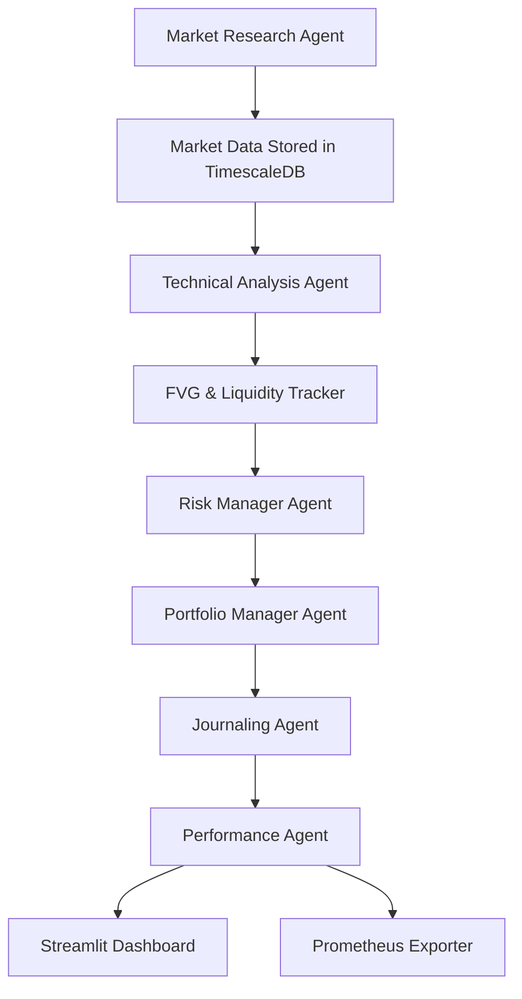

# 📄 Product Requirements Document (PRD)

- Agentic Trading Bot for IFVG + Liquidity Strategy
- Owner: KaalaAadmi
- Environment: Homelab server (Fedora 41, 32GB RAM, Ryzen 7 8845HS)

## 🔍 1. Overview

The Agentic Trading Bot is a modular trading automation system designed to implement the Inverse Fair Value Gap (IFVG) + Liquidity strategy, using agent-based architecture. It will autonomously research markets, perform technical analysis, place trades, and monitor performance, all within a containerized and scalable infrastructure deployed in the homelab.

## 🧠 2. Objective

- Implement a consistently profitable discretionary strategy into a rule-based system.

- Avoid overfitting by focusing on confluence (MSB, OBs, IFVGs, liquidity, sessions, volume).

- Maintain modularity to support agent iteration and evolution.

- Enable visual monitoring, logging, and manual review of trade decisions.

## 🧰 3. Tech Stack

| Component            | Choice                        | Reason                                                        |
| -------------------- | ----------------------------- | ------------------------------------------------------------- |
| Language             | Python                        | Ecosystem richness, speed of development, strong finance libs |
| Containerization     | Docker + Docker Compose       | Service isolation, portability, clean setup                   |
| Orchestration        | Docker Compose                | Lightweight, easy to manage in homelab                        |
| Scheduler            | APScheduler                   | Embedded scheduling, flexibility, job management              |
| Database             | TimescaleDB (PostgreSQL ext.) | High-performance time-series storage                          |
| Message Broker       | Redis pub/sub                 | Simple, low-latency pub/sub messaging                         |
| API Layer            | FastAPI                       | Async microservice-style endpoints between agents             |
| Monitoring           | Prometheus + Grafana          | Real-time system + agent monitoring                           |
| Frontend (Dashboard) | Streamlit                     | Quick UI for performance monitoring and review                |
| Backtesting          | Custom                        | Tailored to strategy; supports IFVG, liquidity, and MSB rules |

---

## 📦 4. Packages & Libraries

- Data & Analysis:

  - pandas, numpy, datetime

  - yfinance, ccxt (data ingestion)

  - TA-Lib, scikit-learn (optional use)

- Database:

  - psycopg2, sqlalchemy, asyncpg, alembic

- Redis Pub/Sub:

  - redis-py

- APIs:

  - fastapi, pydantic, uvicorn

- Scheduling:

  - apscheduler

- Backtesting:

  - Custom Python backtest engine

- Dashboard & Monitoring:

  - streamlit, plotly, matplotlib

  - prometheus_client, grafana

---

## 🤖 5. AI/Intelligent Agents

Currently, agents are rule-based but designed in a way that future ML/AI modules can be plugged in. Potential areas for adding AI:

- Market Research Agent:

  - Learn optimal screening filters based on past performance.

- Risk Manager Agent:

  - Learn optimal bet sizing dynamically.

- Anomaly Detector Agent:

  - Use ML models to detect strategy underperformance.

- Feedback Agent:

  - Use Reinforcement Learning to self-tune entry rules over time.

## For v1, logic will be deterministic and strategy-driven to avoid overfitting and maintain transparency.

## 🧩 6. Agent Architecture & Responsibilities

- Agent Name Responsibility
- Market Research Agent -> Screens assets, fetches OHLCV, stores raw candles
- Market Data Agent (Optional) -> Fetches additional or historical candles
- Technical Analysis Agent -> Detects IFVGs, liquidity levels, MSBs
- FVG Tracker Agent -> Maintains registry of active FVGs, liquidity pools
- Risk Manager Agent -> Calculates dynamic risk %, sizing based on strategy confluence
- Portfolio Manager Agent -> Confirms trade decisions, interacts with broker API
- Journaling Agent -> Logs trades, reasons, timestamps, screenshots, etc.
- Performance Agent -> Analyzes PnL, win rate, R:R, drawdown; updates dashboard
- Notification Agent -> Sends Telegram/Discord alerts (optional)
- Anomaly Detector Agent -> Detects abnormal strategy performance (optional)

---

## 🧠 7. How the Bot Works (System Flow)



---

## 🗃️ 8. Folder Structure

```bash
agentic-trading-bot/
├── agents/
│ ├── market_research/
│ ├── market_data_collector/
│ ├── technical_analysis/
│ ├── fvg_tracker/
│ ├── risk_manager/
│ ├── portfolio_manager/
│ ├── journaling/
│ ├── performance/
│ ├── notification/
│ └── common/ # Shared logic
│
├── api/                  # FastAPI routes
│
├── core/
│   ├── scheduler/              # APScheduler jobs
│   ├── redis_bus/              # Redis pub/sub client
│   ├── logs/
│   |   ├── agent_logs/
│   └── config
│       ├── scheduler_config.yaml
│       └── settings.yaml
│
├── dashboard/                 # Streamlit UI
|
├── db/
│ ├── init.sql
│ └── migrations/
|
├── docker/
│ ├── docker-compose.yml
│ └── Dockerfiles/
│
├── backtesting/               # Custom replay engine
│
├── tests/
│   ├── integration/
│   └── unit/
│
├── requirements.txt
├── .env
└── README.md
```

---

### 📊 9. Database Schema Highlights

Database Engine: PostgreSQL (TimescaleDB extension)

### Tables:

- ohlcv_data: OHLCV candles for all tracked tickers

- tracked_fvgs: All unmitigated FVGs with metadata

- tracked_liquidity: Identified liquidity zones (buy/sell-side)

- journal: Trade logs with reasons, R:R, screenshots, results

- performance_metrics: PnL, win/loss, drawdown, and more

---

## 🧾 Final TODO Summary

### 📦 Infrastructure

- [ ] Set up TimescaleDB (via Docker)

- [ ] Set up Redis (Pub/Sub)

- [ ] Set up Prometheus + Grafana

- [ ] Create shared .env and settings.yaml

- [ ] Define Docker Compose for multi-agent architecture

### 🧠 Core Modules

- [ ] Implement Redis Pub/Sub wrapper

- [ ] Build API layer (FastAPI)

- [ ] Logging system for agent health

### 🧠 Agent Development

- [ ] Market Research Agent

- [ ] Market Data Collector

- [ ] Technical Analysis Agent

- [ ] FVG & Liquidity Tracker Agent

- [ ] Risk Manager Agent

- [ ] Portfolio Manager Agent

- [ ] Journaling Agent

- [ ] Performance Agent

- [ ] Notification Agent (Optional)

### 📈 Dashboard & Monitoring

- [ ] Implement Streamlit dashboard

- [ ] Live portfolio stats + journal history

- [ ] Charts: RR, PnL, drawdown, etc.

- [ ] Prometheus exporters per agent

### 🧪 Backtesting System

- [ ] Replay engine

- [ ] Strategy validation

- [ ] Journaling integration

- [ ] Metrics tracking

### 🧪 Testing + Stability

- [ ] Unit tests (pytest)

- [ ] Integration test with dummy data

- [ ] Backtest vs live signal reconciliation

---

## 📌 Final Notes

This PRD lays out a scalable, robust blueprint for turning your discretionary system into a fully-automated quantitative bot. The modular agent design ensures:

High cohesion within agents

Low coupling between services

Easy iteration and debugging

With this architecture, the bot can evolve over time into a semi-intelligent, risk-aware trading system capable of adapting to changing market conditions.
